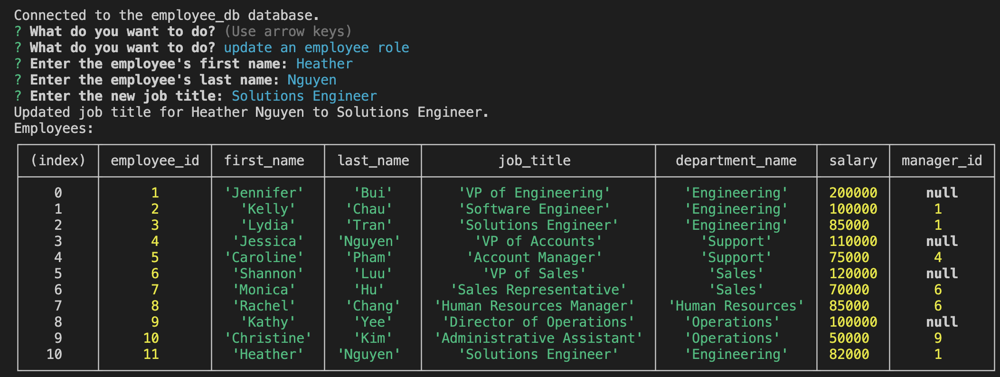
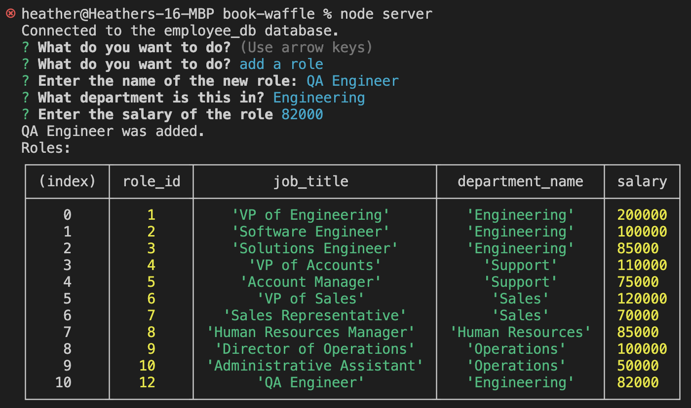

# SQL Challenge: Employee Tracker
Developers frequently have to create interfaces that allow non-developers to easily view and interact with information stored in databases. These interfaces are called content management systems (CMS). This project is to build a command-line application from scratch to manage a company's employee database, using Node.js, Inquirer, and MySQL.

## Table of Contents
- [Installation](#installation)
- [Usage](#usage)
- [Features](#features)
- [Examples](#examples)
- [Video](#video)

## Installation
1. Clone the repo. 
2. In the terminal, "npm i". 
3. To start the application, "npm start"

## Usage
This application manages a company's employee database, using Node.js, Inquirer, and MySQL.

## Features
SQL, Node.js npm

## Examples
### Adding an employee

### Adding a role

## Video
